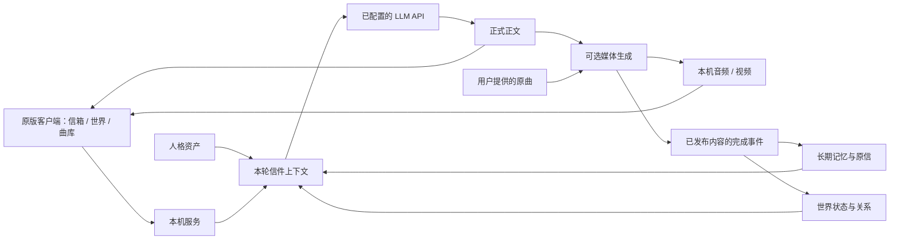

# BSide Olivia Community

<div align="center">

**把 Olivia 的写信、回信与生活延续留在本地。**

[](https://github.com/Ornn8/bside-olivia-community/actions/workflows/public-smoke.yml)
[](https://www.python.org/)
[](docs/WINDOWS_FULL_PATCH.md)
[](LICENSE)

[下载最新版](https://github.com/Ornn8/bside-olivia-community/releases/latest) · [安装与升级](#安装与升级) · [文档索引](docs/README.md) · [反馈问题](https://github.com/Ornn8/bside-olivia-community/issues)

</div>

BSide Olivia Community 是面向 Windows 的非官方本地陪伴复刻项目。它复用用户合法取得的原版客户端，在隔离副本中接入本机后端，保留写信、等待和回信体验，并加入长期记忆、林离世界、语音与翻唱。

**本地运行不等于所有模型都离线。** 信件、记忆数据库和生成媒体保存在本机；文字回信及部分记忆、世界整理使用你配置的 LLM API，相关上下文会发送给该服务。语音、翻唱和口型组件按需在本地运行。Live 实时对话目前暂停开发。

## 安装与升级

需要 Windows 10/11 x64、合法取得的原版客户端 `0.0.9.627`，以及 DeepSeek API key 或自行配置的 OpenAI-compatible 服务。文字回信不要求独立显卡；媒体组件有各自的显存和磁盘要求。

前往 [GitHub 最新发行](https://github.com/Ornn8/bside-olivia-community/releases/latest)，按用途选择：

| 你的情况 | 下载与操作 |
| --- | --- |
| 首次安装 | 下载 `Olivia-<版本>-Setup-x64.exe`，运行后选择正版 Steam 游戏目录。安装器创建隔离副本，不修改正版目录。 |
| 已有可用的 Olivia | 下载 `Olivia-<版本>.oliviapatch`，在设置的“补丁更新”中导入。按提示填写对应 `.manifest.sha256` 文件中的 Manifest 校验值，完成后关闭并重新打开程序。 |
| 核对下载文件 | `.sha256` 是校验文件，不是安装组件；补丁文件校验值与 Manifest 校验值不要混用。 |

安装器包含固定版本的核心 Python 运行环境和 **FFmpeg**。可选模型在登录后的初始设置中按需安装，也可在本地能力设置中导入对应离线包。语音、翻唱、口型及长期记忆等组件按需要配置；已有兼容组件可以继续复用，普通补丁升级无需重新下载模型。

**已装过 FFmpeg 就不必重复安装 tools 包。** 它是媒体工具依赖，不是新增模型。已经正常使用 1.1.0 的用户，也无需仅为安装失败诊断更新而重装整个客户端；是否更新以对应发行说明为准。

1.1.0 起，安装器、程序与升级补丁采用统一版本号。`2250.10` 等旧标识仅保留在历史发行与兼容记录中。

首次启动时配置 API key。密钥由当前 Windows 用户通过 DPAPI 加密保存；解密值仅用于后端，不写入日志。升级保留信件、记忆与已有组件。安装失败时请保留日志和诊断信息，通过 [Issues](https://github.com/Ornn8/bside-olivia-community/issues) 反馈，勿附 API key 或未经处理的私人信件。

详细步骤见 [Windows 安装、升级与回滚](docs/WINDOWS_FULL_PATCH.md)。各版附件和已知问题以发行说明为准。

## 可以做什么

### 写信与语音回信

写信窗口提供普通信件与翻唱入口。正文由同一条人格、记忆和世界上下文链路生成，语音与视频再从正式正文派生。思考内容不会作为正文或记忆。

媒体回复支持“说话”“唱歌”“说话＋唱歌”，并可选择是否生成视频；实际可用项取决于本机组件是否准备完整。音频可在信箱内播放、查看波形和拖动进度。媒体失败时保留文字回信；混合回复中已单独发出的语音可以先听，歌曲可另行重试。

### 翻唱与曲库

在翻唱入口提供原曲音频，确认自动识别的歌词或手动补充后寄出。当前翻唱链路使用 **ACE-Step 1.5 XL 与林离音色 LoRA**；原曲是翻唱的必要输入，旧 MiniMax 自由音乐生成流程不再是当前入口。

普通信件与翻唱共用写信窗口，相关选项随模式展开。翻唱完成后出现在信箱中，也可收藏到曲库。音色、旋律保留程度、耗时与显存占用会受到原曲、参数、模型及设备影响，不保证所有机器效果一致。

### 林离世界

“世界”是位于“信箱”和“曲库”之间的独立主页面，展示此刻近况、持续事项、生活片段和与你有关的约定。页面采用可折叠布局，历史片段可以继续翻阅。

她的生活按实际时间延续：作息、休息、疲劳与已有事项会影响当下安排。旧分享不会直接冒充实时活动，独立承诺可以分别完成、取消或改期。关系状态与日常情绪分开，用户的示好、提问或玩笑不自动确立关系。

正常日常补充、调侃和轻微情绪变化属于角色表达；人格核心、已经确认的重要事实与双方约定应保持一致。设计与历史验证见 [林离世界](docs/LINLI_WORLD.md) 和 [生活状态的数据边界](docs/PRIVATE_WORLD_LIFE.md)。

### 记忆与媒体完成记录

Mem0 保存与后续交流有关的长期事实，近期原信与回信提供可回溯的上下文；数据按用户隔离。记忆预算不足时会跳过过大的条目，继续尝试能放下的完整条目。

已发布的语音、翻唱或音乐会以结构化完成事件关联原信，并写入世界日志，供后续回信召回。这里保存的是内容类型、来源及完成事实，不把音视频文件本身塞进文本记忆；媒体文件仍由本机媒体目录管理。

- 只记录实际完成并发布的部分；重试不重复增加同一事件。
- 歌词不等于真实经历或双方承诺，素材编号不冒充歌名。
- 世界回写暂时失败时，保留原信中的事件以便恢复。
- 旧版媒体不会仅凭 `COMPLETED` 状态自动补写完成事件。

媒体完成事件已覆盖合成渲染器、真实存储和检索回归；**长期 Mem0／世界提取写回仍需持续验证**，不能将自动化测试等同于长期人格稳定或所有事实都能正确召回。

## 当前技术与运行方式



| 模块 | 当前职责 |
| --- | --- |
| 本机服务 | Python 3.12、aiohttp、后台任务、持久化与恢复 |
| 模型网关 | OpenAI-compatible API；支持 DeepSeek，推理内容与最终正文分开处理 |
| 人格 | 带来源与层级的人格资产，按上下文预算装配 |
| 记忆与世界 | Mem0、离线 embedding、SQLite 生活事项与关系账本；隐藏关系数值不直接进入回信 |
| 语音 | Breeze TTS 2 与对应音色组件 |
| 翻唱 | ACE-Step 1.5 XL、林离音色 LoRA、用户原曲及歌词 |
| 视频 | 原版场景素材、LatentSync 口型与 FFmpeg 合成 |
| 质量与验证 | 出处及状态边界、Schema、pytest、Windows CI、发布扫描；当前正式回信路径不经过额外模型审核改写 |

客户端视频默认通过 Collection 内的 `BaseVideo` 播放，本机媒体由 `/toy/media/` 提供；这是默认书信编排路线。Web 播放器仅作为可选的显式 `uid` 本机回退，不替代原生播放器。

模型与第三方组件通过薄适配器接入，不包含在源码仓库中。媒体生成失败不能删除已发布正文，也不能因重试重复提交关系变化。历史文档中的 MiniMax、RoFormer、SoulX 方案，以及“说话段＋约 60 秒音乐段”的固定视频描述属于旧链路，当前用法以本页及最新发行说明为准。

## 验证范围与发布边界

1.1.0 安装器已通过实际隔离安装，内置 Python 和 FFmpeg 可运行，补丁也通过隔离应用；GitHub 对应检查通过。DPAPI 当前用户启动读取修复已合入。真实客户端验收的范围和结果见对应发行说明，不代表所有设备均通过，遇到安装失败仍需根据日志定位。

文字回信、世界状态和媒体编排已有模型实验及自动化回归；不同设备的音色、口型、完整歌曲质量与长期记忆效果仍需实际使用验收。Live 实时对话暂停，不进入当前发布范围。

## 从源码运行与参与开发

普通用户优先使用发行版安装器。开发者可按下面的入口操作：

```powershell
git clone https://github.com/Ornn8/bside-olivia-community.git
cd bside-olivia-community
.\INSTALL.cmd
.\START.cmd
```

安装与启动脚本仍要求兼容的原版资源，源码仓库不提供这些资源。`CONFIGURE.cmd` 可用于配置 API key 与可选参考文件。

```powershell
py -3.12 -m venv .venv
.\.venv\Scripts\Activate.ps1
python -m pip install -r requirements-dev.txt
python -m pytest -q
python baseline_hardening_scan.py --mode all
git diff --check
```

| 路径 | 内容 |
| --- | --- |
| `runtime/` 与根目录 Python 入口 | 产品后端、记忆、世界、模型及媒体编排 |
| `linli_character/` | 可公开的人格资产及来源信息 |
| `installer/` | 安装、启动、配置、升级和卸载 |
| `contracts/` | Schema 与公开接口契约 |
| `tests/` | 合成测试与回归用例，不包含私人信件 |
| `tools/`、`docs/` | 工程工具、用户文档与历史验收记录 |

更多入口见 [文档索引](docs/README.md) 与 [仓库结构](docs/REPOSITORY_LAYOUT.md)。提交前请阅读 [贡献指南](CONTRIBUTING.md)、[安全政策](SECURITY.md) 和 [行为准则](CODE_OF_CONDUCT.md)。

## 隐私、版权与分发

源码仓库不包含原版程序及资源归档、私人信件、API key、用户数据库、声音参考、生成媒体或第三方模型权重。安装器包含经清单和哈希校验的核心依赖；大型模型及其他可选离线组件按各自许可证和分发范围提供。

项目自有代码及未另行标注的原创技术文档采用 [Apache License 2.0](LICENSE)。该许可证不授予原版游戏、角色、商标、官方素材、第三方模型或用户内容的权利。

本项目与原作者、发行方及相关权利方没有隶属、授权或背书关系。详细边界见 [资产与权利政策](ASSET_POLICY.md)、[公开仓库边界](docs/PUBLIC_REPOSITORY.md) 和 [第三方声明](THIRD_PARTY_NOTICES.md)。
