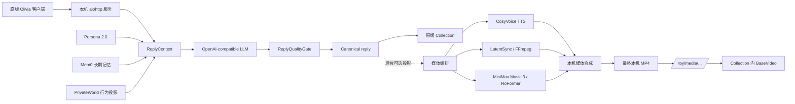

# BSide Olivia Community

<div align="center">

**把 Olivia 的写信与回信体验留在本地，并将人格、记忆与生成媒体变成可维护的开放工程。**

[](https://github.com/Ornn8/bside-olivia-community/actions/workflows/public-smoke.yml)
[](https://www.python.org/)
[](docs/WINDOWS_FULL_PATCH.md)
[](LICENSE)

[安装说明](docs/WINDOWS_FULL_PATCH.md) · [文档索引](docs/README.md) · [项目进度](https://github.com/Ornn8/bside-olivia-community/issues) · [第三方下载](docs/THIRD_PARTY_DOWNLOADS.md)

</div>

BSide Olivia Community 是面向 Windows 的非官方本地陪伴复刻项目。它保留原版客户端的 Collection、写信、等待与回信交互，同时以本机后端替代已经不可持续依赖的在线链路。

项目并不重新制作一个聊天壳。核心目标是让原版体验、可审计人格、长期记忆、私有关系状态和离线媒体生成组合成一条可维护、可降级、可替换的产品管线。

> **发布边界：** 文字回信主链可运行；视频与音乐回信的自动阶段链路已验证，完整成片的发布/真实客户端验收尚未完成。DPAPI 当前用户启动读取修复已合入；可选模型在登录后的初始设置中按需安装，并可在客户端 Settings 管理。Live 实时对话暂停开发。

## 项目做到了什么

- 复用用户合法取得的原版 `0.0.9.627` 客户端，在隔离副本内接入本机服务，不修改正版 Steam 目录；
- 将来信、Persona、记忆、PrivateWorld 与审校装配为唯一 canonical reply，再投影为文字或媒体；
- 通过原版 Collection 展示回信；书信视频由 Collection 内的 `BaseVideo` 播放，避免另造第二套日常使用界面；
- 把 TTS、口型、音乐、ASR 和视觉能力放在可替换 provider 后，缺失时返回真实状态；
- 将私人信件、API key、数据库、声音参考、模型权重和生成媒体留在用户本机；
- 用 Windows CI、JSON Schema、合成 fixture 和发布扫描约束兼容性、隐私与失败边界。

## 架构



正文先成为 canonical reply，关系事件只提交一次。媒体生成是正文的后台投影；TTS、视觉或音乐失败不能删除正文，也不能重复改变记忆和关系状态。

书信视频的最终本机 MP4 通过 `/toy/media/...` 投影到 Collection 内的 `BaseVideo`，这是默认书信编排路线。安装器为 `webplayer` 保留可选的显式 `uid` 本机回退：它只接受 loopback `/toy/media/...` URL 并在该 URL 被显式传入时播放，不替代 `BaseVideo` 或改变默认书信路线。

## 关键技术

| 层 | 技术与职责 |
| --- | --- |
| 本机服务 | Python 3.12、`aiohttp`、loopback HTTP、后台任务恢复 |
| 接口契约 | JSON Schema、稳定错误码、幂等 request ID、fail-closed 校验 |
| 模型网关 | OpenAI-compatible API；默认适配 DeepSeek，支持结构化工具调用 |
| Persona | Persona 2.0、provenance、prompt budget、ReplyContext、可审计装配 |
| 回信质量 | 确定性策略检查、一次模型审校、全局最多一次正文重写 |
| 长期记忆 | Mem0、`sentence-transformers` 离线 embedding、按用户隔离的本机数据根 |
| 私有关系 | SQLite 事件账本、reducer、有限行为投影；隐藏数值不直接进入模型 |
| 语音 | CosyVoice 3、VoicePerformancePlan、整段单次 TTS、ASR 质量门禁 |
| 视频 | 原版场景、LatentSync 1.5 口型适配、FFmpeg 转场与时间线合成 |
| 音乐 | MiniMax Music 3、结构化歌词与音乐方向、RoFormer 人声分离、钢琴场景 |
| ASR / Live | NeMo-Speech.cpp 接口与流式契约；Live 当前暂停，不属于发布范围 |
| Windows 安装 | PowerShell、受管 Python、Steam AppID 发现、归档哈希校验、DPAPI |
| 工程质量 | `pytest`、Windows GitHub Actions、hardening scan、合成隐私 fixture |

第三方运行时和模型均由用户在仓库外提供。本项目只维护薄适配器、配置、契约、编排、安装生命周期和验收测试，不在仓库内重造或分发模型。

## 回信链路

产品界面主要呈现“文字回信”和“视频回信”。内部为了调度、降级与验收，将媒体投影拆成三个模式：

### 文字回信

来信经过 Persona、上下文、长期记忆和 PrivateWorld 行为提示装配，再由 LLM 生成正文。正文通过质量门后持久化，并按真实产品节奏延迟送达。

这是当前最成熟的主链。模型不可用时会报告 `UNAVAILABLE` 或 `DEGRADED`，不会把静态模板伪装成真实模型回信。

### 视频回信

`spoken_video` 交付 **CosyVoice 说话 + 固定原版日常动作底片 + LatentSync 口型**；`musical_video` 才追加固定原版转身/黑屏转场、钢琴场景演唱与渐暗收尾。两条运行链分别判定 readiness；LiveTalking 仅是独立可选的实时能力。歌曲、歌词和表演方向由同一封信的 canonical reply 派生。

后台阶段清单 schema v3 将固定说话动作底片纳入内容指纹；旧版清单会自动失效并重建对应阶段。代码入口与 provider 合约已经接入，但不同机器上的 TTS、口型、面部稳定性和场景衔接仍需人工视听验收。

当前目标是一首约 40–60 秒的完整短歌，而不是几句演示音频。MiniMax、分离、口型与合成均为后台串行任务，RTX 3080 10GB 主要面向离线生成，不承诺实时速度。

## Persona、记忆与 PrivateWorld

Persona 不是一段无限增长的 system prompt。公开人格文件带有来源与版本信息，并通过预算器、上下文合同和质量门装配到单次回信中。

Mem0 保存可检索的长期事实；PrivateWorld 保存私有关系事件。两者职责分离：记忆负责“发生过什么”，PrivateWorld 负责把关系变化投影为有限的行为提示。

私人关系数值不会直接暴露给模型。视频重试、音乐重渲染和播放器失败也不会再次提交关系事件。

## 安装

### 基础要求

- Windows 10/11 x64；
- 用户合法取得的原版客户端 `0.0.9.627`；
- DeepSeek API key，或开发者自行配置的 OpenAI-compatible 接口；
- 文字回信不要求独立显卡；视频、TTS 和音乐 provider 有各自显存与磁盘要求。

### 源码安装

```powershell
git clone https://github.com/Ornn8/bside-olivia-community.git
cd bside-olivia-community
.\INSTALL.cmd
.\START.cmd
```

安装器创建隔离副本并自动查找 Steam AppID `4532590`。正版目录不写入补丁、备份或生成数据；版本或关键归档哈希不匹配时会在写入前停止。

`CONFIGURE.cmd` 用于保存 API key 和可选参考文件。密钥通过当前 Windows 用户的 DPAPI 加密保存；启动器已把解密值仅注入后端子进程，客户端与日志都不会接收它。环境变量仍可显式覆盖；这不等同于发布或真实客户端验收完成。

大型 TTS、视觉与音乐模型不随安装包分发。请按[第三方下载清单](docs/THIRD_PARTY_DOWNLOADS.md)从上游获取，并接受各自许可证。

## 当前成熟度

| 能力 | 状态 | 证据边界 |
| --- | --- | --- |
| 原版客户端隔离接入 | 可运行 | 已验证安装、启动、本机 health 与 Collection 接入 |
| 文字回信 | 可运行 | 已完成真实 LLM 回信；仍需长期人格与记忆盲测 |
| Persona 2.0 / 审校 | 已接入 | 合成与回归测试覆盖；效果仍依赖模型 |
| PrivateWorld | 已接入 | 本机 ledger、reducer 和管理接口可用 |
| Mem0 | 实验可用 | 准备好的环境可写入和召回；一键新装仍在修复 |
| 普通视频 | 实验性 | provider 可探测；最终人物效果尚未人工通过 |
| 音乐视频 | 实验性 | 编排与模型接口存在；耗时、路由和稳定性仍待验收 |
| Live 实时对话 | 暂停 | 不进入当前 Release |
| 正式 Release | 未发布 | 当前只提供源码和验收候选，不宣称最终发布完成 |

CI 通过只证明对应代码、契约和合成 fixture 通过，不等于第三方模型、真实 GPU、原版客户端或人工视听验收完成。

## 仓库结构

| 路径 | 内容 |
| --- | --- |
| 根目录 Python 模块 | 当前产品运行时与兼容导入入口 |
| `linli_character/` | 可公开的人格配置、风格特征与 provenance |
| `control_center/` | Memory 与 PrivateWorld 本地管理界面 |
| `installer/` | Windows 安装、启动、配置、升级和卸载 |
| `contracts/` | JSON Schema 与公开接口契约 |
| `tts/`, `asr/`, `visual_driver/` | 可替换的媒体 provider 适配层 |
| `runtime/`, `media_state/` | 可选运行时装配、媒体状态与资源引用 |
| `tests/` | 合成 fixture 与回归测试，不包含私人数据 |
| `tools/` | 审计、健康检查、provider worker 和维护工具 |
| `docs/` | 用户、架构、验收和治理文档 |

完整职责见[仓库结构说明](docs/REPOSITORY_LAYOUT.md)，文档入口见[文档索引](docs/README.md)。

## 开发与验证

```powershell
py -3.12 -m venv .venv
.\.venv\Scripts\Activate.ps1
python -m pip install -r requirements-dev.txt
python -m pytest -q
python baseline_hardening_scan.py --mode all
git diff --check
```

本地后端可以直接运行：

```powershell
python local_server.py
```

提交前请阅读[贡献指南](CONTRIBUTING.md)、[安全政策](SECURITY.md)和[行为准则](CODE_OF_CONDUCT.md)。优先提交单一职责、可回滚的小 PR，并同时说明验证结果与未验证边界。

## 隐私、版权与分发

公开仓库和 Release 不包含：

- 原版程序、`feapp.dat`、`webplayer.dat`、解包前端、角色视频、背景或音乐；
- CosyVoice、LiveTalking、MiniMax、LatentSync 等第三方运行时、模型权重和缓存；
- 私人信件、声音参考、生成媒体、用户数据库、抓包、Token 或 API key；
- 开发者机器的绝对路径、私有配置、验收证据或本地工作树。

项目自有代码及未另行标注的原创技术文档采用 [Apache License 2.0](LICENSE)。该许可证不授予任何原版游戏、角色、商标、官方素材、第三方模型或用户内容的权利。

本项目与原作者、发行方及相关权利方没有隶属、授权或背书关系。详细边界见[资产与权利政策](ASSET_POLICY.md)、[公开仓库边界](docs/PUBLIC_REPOSITORY.md)和[第三方声明](THIRD_PARTY_NOTICES.md)。
