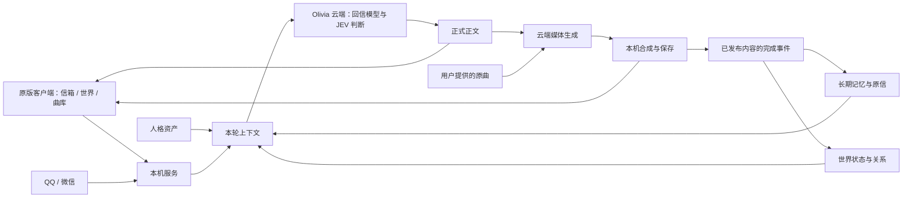

<div align="center">

  

# BSide Olivia Community

**把和林离的写信、回信与生活延续，留在你的电脑上。**

[](https://github.com/Ornn8/bside-olivia-community/actions/workflows/public-smoke.yml)
[](https://github.com/Ornn8/bside-olivia-community/releases/latest)
[](client/docs/WINDOWS_FULL_PATCH.md)
[](LICENSE)

**[下载最新版](https://github.com/Ornn8/bside-olivia-community/releases/latest)** · [快速开始](#快速开始) · [更新记录](#更新记录) · [文档索引](client/docs/README.md) · [反馈问题](https://github.com/Ornn8/bside-olivia-community/issues)

</div>

<br>

BSide Olivia Community 是面向 Windows 的**非官方**陪伴复刻项目。它在你合法取得的原版客户端的隔离副本里接入本机后端：写信、等待、收到回信的体验保持原样，另外加上长期记忆、林离的日常世界、QQ 聊天、语音、照片和歌曲。

> [!NOTE]
> **信件和记忆在本机，生成在云端。** 信件、长期记忆、世界记录和收到的媒体都保存在你的电脑上；回信、语义判断和语音、照片、歌曲、视频由 Olivia 云端生成。只需要一个 Olivia 账户 Key，不需要独立显卡。

## 能做什么

<table>
<tr>
<td width="50%" valign="top">


### 写信与回信

写一封信，隔一段时间收到林离的回信。回信可以是文字，也可以附上她的声音、照片或唱给你的歌，由信的内容和你允许的回信方式决定。音频在信箱里就能播放、看波形、拖动进度。

</td>
<td width="50%" valign="top">


### 翻唱与曲库

提供一首原曲，确认歌词后寄出，林离会用她的声音翻唱；也可以请她写一首原创歌曲。完成的歌出现在信箱里，可以收藏到曲库。

</td>
</tr>
<tr>
<td valign="top">


### QQ / 微信聊天

绑定后在 QQ 上和林离聊天，日常短聊时她常用一两句短语音回你，你要照片或语音时照做。她也会在合适的时候主动找你，并尊重你说的“这两天别打扰我”。

</td>
<td valign="top">


### 林离的世界

“世界”页面展示她今天的安排、正在做的事和此刻的心情。她的生活按真实时间延续：上课、吃饭、练琴、睡觉，每天的安排都不一样。

</td>
</tr>
<tr>
<td valign="top">


### 长期记忆

她记得你们聊过的事、双方的称呼和约定，你更正过的说法也会跟着更新。记忆可以在设置里查看、搜索和更正。

</td>
<td valign="top">


### 你的数据在你手里

信件可以一键导出备份，也可以从原版目录或备份文件导入。仓库和安装包都不包含任何私人信件。

</td>
</tr>
</table>

## 快速开始

需要 **Windows 10/11 x64**、合法取得的原版客户端 **`0.0.9.627`**，以及一个 **Olivia 账户 Key**。

1. **下载安装器**：在[最新发行](https://github.com/Ornn8/bside-olivia-community/releases/latest)下载 `Olivia-<版本>-Setup-x64.exe`。
2. **安装**：运行后选择正版 Steam 游戏目录。安装器会创建一份隔离副本，不修改正版目录。
3. **连接账户**：打开 Olivia，点右上角的 **账户** 获取 Key，或导入已有的 Key，然后就可以写信了。

| 你的情况 | 下载哪个文件 |
| --- | --- |
| 第一次安装 | `Olivia-<版本>-Setup-x64.exe` |
| 已经装好，只想升级 | `Olivia-<版本>.zip`（或 `.oliviapatch`），在 **设置 → 更新与帮助 → 选择补丁并更新** 里选择它，完成后完全退出并重新打开 |
| 核对下载是否完整 | `.sha256` 是校验文件，不是安装组件 |

长期记忆等可选模型在登录后的初始设置中按需安装。升级会保留信件、记忆、Key 和设置。详细步骤、回滚和常见问题见 [Windows 安装、升级与回滚](client/docs/WINDOWS_FULL_PATCH.md)。

> [!TIP]
> 2.0.8 及更早版本里，补丁更新在 **设置 → 本地陪伴 → 补丁更新**，账户在右上角 **回信服务 → Olivia 账户**。

### Olivia 账户 Key

同一个 Key 用于回信、语义判断、记忆整理，以及语音、照片、歌曲和视频生成；余额、充值和消费记录都在 **账户** 里查看。Key 由当前 Windows 用户通过 DPAPI 加密保存，只在本机后端使用，不写入日志或页面。

从 2.0.0 起只支持 Olivia 账户 Key，不再支持自填大模型接口或 GPU 服务地址。

## 更新记录

| 版本 | 主要变化 |
| --- | --- |
| **[2.1.3](https://github.com/Ornn8/bside-olivia-community/releases/tag/v2.1.3)** · 当前 | 修复部分回信寄不出去和启动错误码 2；照片默认开启；评估与导入出错时显示具体原因。[更新说明](client/docs/releases/v2.1.3.md) |
| [2.1.2](https://github.com/Ornn8/bside-olivia-community/releases/tag/v2.1.2) | 修复部分回信修改后仍因轻微风格问题无法寄出，完善回信失败诊断。[更新说明](client/docs/releases/v2.1.2.md) |
| [2.1.1](https://github.com/Ornn8/bside-olivia-community/releases/tag/v2.1.1) | 生活里的计划和变化记录更准确，整理失败不再反复扣费；修复部分回信修改失败和语音缺最后半句。[更新说明](client/docs/releases/v2.1.1.md) |
| [2.1.0](https://github.com/Ornn8/bside-olivia-community/releases/tag/v2.1.0) | 新增 QQ 睡前故事与 ASMR 音频；更准确地想起以前约定过的事；长期使用后生活和关系不再停滞。[更新说明](client/docs/releases/v2.1.0.md) |
| [2.0.13](https://github.com/Ornn8/bside-olivia-community/releases/tag/v2.0.13) | QQ 被踢下线后自动重连，不用重新扫码；信里要求语音回复时用语音回信；旧信导入不再重复。[更新说明](client/docs/releases/v2.0.13.md) |
| [2.0.12](https://github.com/Ornn8/bside-olivia-community/releases/tag/v2.0.12) | 修复部分电脑启动失败；林离更常随手拍和自拍；三餐和旧信回忆恢复正常；新增信件对比整理。[更新说明](client/docs/releases/v2.0.12.md) |
| [2.0.11](https://github.com/Ornn8/bside-olivia-community/releases/tag/v2.0.11) | 修复开启图片后普通信一直"回信中"；QQ 重启后不用重新扫码；林离不再挖苦你真诚的话。[更新说明](client/docs/releases/v2.0.11.md) |
| [2.0.10](https://github.com/Ornn8/bside-olivia-community/releases/tag/v2.0.10) | 林离在合适的时候会重新顺手发照片；不再把聊天记录格式念出来、不再重复上一句；启动画面不再挡住其他窗口。[更新说明](client/docs/releases/v2.0.10.md) |

<details>
<summary>更早的版本</summary>

| 版本 | 主要变化 |
| --- | --- |
| [2.0.9](https://github.com/Ornn8/bside-olivia-community/releases/tag/v2.0.9) | QQ 日常聊天更常用短语音；设置页改为四个分组，账户与余额合到右上角；错过饭点会补吃，补觉后能恢复精神。[更新说明](client/docs/releases/v2.0.9.md) |
| [2.0.8](https://github.com/Ornn8/bside-olivia-community/releases/tag/v2.0.8) | 大幅减少 QQ 回复偶发发不出去；要语音时林离一定用语音回复；QQ 回复更省钱。[更新说明](client/docs/releases/v2.0.8.md) |
| [2.0.7](https://github.com/Ornn8/bside-olivia-community/releases/tag/v2.0.7) | QQ 回复附带的设置不合规时只忽略该设置；你约好的联系时间不受林离作息限制。[更新说明](client/docs/releases/v2.0.7.md) |
| [2.0.6](https://github.com/Ornn8/bside-olivia-community/releases/tag/v2.0.6) | 坏心情不再一直延续，回信不再迁怒；修复 Key 带空格时报“账户不可用”。[更新说明](client/docs/releases/v2.0.6.md) |
| [2.0.5](https://github.com/Ornn8/bside-olivia-community/releases/tag/v2.0.5) | 日常不再在后台反复更新没有变化的活动，大幅减少不聊天时的扣费。[更新说明](client/docs/releases/v2.0.5.md) |
| [2.0.4](https://github.com/Ornn8/bside-olivia-community/releases/tag/v2.0.4) | 修复导入的官方旧信被当作 1970 年的信。[更新说明](client/docs/releases/v2.0.4.md) |
| [2.0.3](https://github.com/Ornn8/bside-olivia-community/releases/tag/v2.0.3) | 修复回忆失效导致编造往事，记住双方称呼；回信成本更低。[更新说明](client/docs/releases/v2.0.3.md) |
| [2.0.2](https://github.com/Ornn8/bside-olivia-community/releases/tag/v2.0.2) | 修复长回信和长期使用后寄信失败、历史回忆失效；余额不足明确提示。[更新说明](client/docs/releases/v2.0.2.md) |
| [2.0.1](https://github.com/Ornn8/bside-olivia-community/releases/tag/v2.0.1) | 修复 1.x 升级用户寄信失败、“给我看看”被误判为视频、随信照片光线不符。[更新说明](client/docs/releases/v2.0.1.md) |
| [2.0.0](https://github.com/Ornn8/bside-olivia-community/releases/tag/v2.0.0) | 世界连续性、持续情绪、JEV 云端判断、新开机动画；只保留 Olivia 账户 Key。[更新说明](client/docs/releases/v2.0.0.md) |
| [1.3.14](https://github.com/Ornn8/bside-olivia-community/releases/tag/v1.3.14) | QQ 语音优先调度，照片与语音不再互相排队。[更新说明](client/docs/releases/v1.3.14.md) |

</details>

各版附件、升级方式和已知问题以对应更新说明为准。

## 什么在本机，什么在云端

| 保存在你的电脑上 | 由 Olivia 云端生成 |
| --- | --- |
| 信件原文与回信 | 文字回信 |
| 长期记忆数据库 | 语义判断（JEV） |
| 林离的世界与关系记录 | 语音、照片、歌曲与口型视频 |
| 已收到的语音、照片、歌曲和视频 | |
| 加密保存的 Olivia Key | |

生成时，本轮需要的上下文（相关信件、记忆和世界状态）会发送给云端服务。实时对话（Live）以后再做，不在当前版本中。

<details>
<summary><b>技术概览</b></summary>

<br>


```mermaid
flowchart LR
    Client[原版客户端：信箱 / 世界 / 曲库] --> Server[本机服务]
    QQ[QQ / 微信] --> Server
    Persona[人格资产] --> Context[本轮上下文]
    Memory[长期记忆与原信] --> Context
    World[世界状态与关系] --> Context
    Server --> Context
    Context --> Cloud[Olivia 云端：回信模型与 JEV 判断]
    Cloud --> Reply[正式正文]
    Reply --> Client
    Reply --> Media[云端媒体生成]
    Source[用户提供的原曲] --> Media
    Media --> Files[本机合成与保存]
    Files --> Client
    Files --> Delivered[已发布内容的完成事件]
    Delivered --> Memory
    Delivered --> World
```

| 模块 | 职责 |
| --- | --- |
| 本机服务 | Python 3.12、aiohttp、后台任务、持久化与恢复、最终视频合成（FFmpeg） |
| 回信模型 | Olivia 云端回信服务（OpenAI 兼容协议，`qwen3.7-flash`），推理内容与正文分开处理 |
| JEV 判断 | 回复意图、媒体选择、信息选择、世界更新、情绪与记忆提取等语义判断，结构化输出 |
| 人格 | 带来源与层级的人格资产，按当前话题选择相关部分 |
| 记忆与世界 | 本机 Mem0、离线 embedding、SQLite 生活事项与关系账本；隐藏关系数值不直接进入回信 |
| 媒体生成（云端） | 语音 Breeze TTS、翻唱 ACE-Step 1.5 XL 与林离音色 LoRA、原创歌曲、照片 Qwen Image、口型 LatentSync |
| 质量与验证 | 出处与状态边界、Schema、pytest、Windows CI、发布扫描 |

- 媒体生成失败不会删除已发出的文字回信，重试也不会重复记录关系变化。
- 已发布的语音、照片或歌曲会作为完成事件关联原信并写入世界日志，供之后的回信回忆；只记录实际发出的部分。
- 文字回信、世界状态和媒体编排有模型实验和自动化回归；音色、口型、歌曲质量和长期记忆效果仍需实际使用验收。

客户端视频默认通过 Collection 内的 `BaseVideo` 播放，本机媒体由 `/toy/media/` 提供；这是默认书信编排路线。Web 播放器仅作为可选的显式 `uid` 本机回退，不替代原生播放器。

历史文档中的 MiniMax、RoFormer、SoulX 方案，“说话段＋约 60 秒音乐段”的固定视频描述，以及本机 GPU 生成和自填模型接口，都属于旧链路；当前用法以本页及最新更新说明为准。

**验证范围与发布边界：** DPAPI 当前用户启动读取修复已合入。各版本在真实客户端验收的范围和结果见对应更新说明，不代表所有设备均通过；遇到安装失败仍需根据日志定位。

设计与数据边界见 [林离世界](client/docs/LINLI_WORLD.md) 和 [生活状态的数据边界](client/docs/PRIVATE_WORLD_LIFE.md)。

</details>

<details>
<summary><b>从源码运行与参与开发</b></summary>

<br>

普通用户请使用发行版安装器。客户端源码在 `client/`，以下命令都在该目录执行：

```powershell
git clone https://github.com/Ornn8/bside-olivia-community.git
cd bside-olivia-community/client
.\INSTALL.cmd
.\START.cmd
```

安装与启动脚本需要兼容的原版资源，源码仓库不提供这些资源。启动后点右上角 **账户** 获取或导入 Olivia 账户 Key。

```powershell
py -3.12 -m venv .venv
.\.venv\Scripts\Activate.ps1
python -m pip install -r requirements-dev.txt
python -m pytest -q
python baseline_hardening_scan.py --mode all
git diff --check
```

| 路径 | 内容 |
| --- | --- |
| `client/runtime/` 与 `client/` 内的 Python 入口 | 后端、记忆、世界、模型及媒体编排 |
| `client/linli_character/` | 可公开的人格资产及来源信息 |
| `client/installer/` | 安装、启动、配置、升级和卸载 |
| `client/contracts/` | Schema 与公开接口契约 |
| `client/tests/` | 合成测试与回归用例，不含私人信件 |
| `client/tools/`、`client/docs/` | 工程工具、用户文档与历史验收记录 |

更多入口见 [文档索引](client/docs/README.md) 与 [仓库结构](client/docs/REPOSITORY_LAYOUT.md)。提交前请阅读 [贡献指南](CONTRIBUTING.md)、[安全政策](SECURITY.md) 和 [行为准则](CODE_OF_CONDUCT.md)。

</details>

## 反馈问题

遇到问题请在 **设置 → 更新与帮助 → 导出诊断包**，然后到 [Issues](https://github.com/Ornn8/bside-olivia-community/issues) 描述情况并附上诊断包。诊断包已经去除私人内容；请不要附上 Olivia Key 或未处理的私人信件。

## 贡献者

感谢 [@QiLiangaiBashan](https://github.com/QiLiangaiBashan) 贡献独立记忆迁移工具、用户说明和迁移回归测试（[#508](https://github.com/Ornn8/bside-olivia-community/pull/508)）。

## 隐私、版权与分发

源码仓库不包含原版程序及资源、私人信件、Olivia Key、用户数据库、声音参考、生成媒体或第三方模型权重。安装器包含经清单和哈希校验的核心依赖。

项目自有代码及未另行标注的原创文档采用 [Apache License 2.0](LICENSE)，该许可证不授予原版游戏、角色、商标、官方素材、第三方模型或用户内容的权利。本项目与原作者、发行方及相关权利方没有隶属、授权或背书关系。详见 [资产与权利政策](client/ASSET_POLICY.md)、[公开仓库边界](client/docs/PUBLIC_REPOSITORY.md) 和 [第三方声明](client/THIRD_PARTY_NOTICES.md)。
